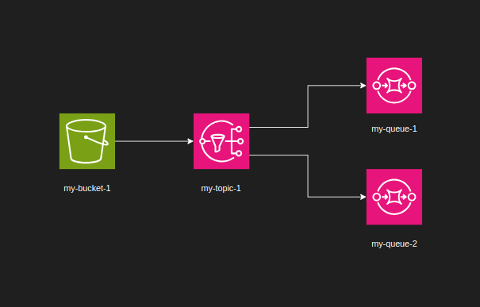

# Projeto

<p align="center">
  
</p>


## Dependências

Para conseguir rodar este projeto é necessário tem instalado docker, docker compose e o terraform. Recomendo que instale o [tfnv](https://github.com/tfutils/tfenv) para gerenciar as versões do terraform.

## Execução

No diretório ./terraform execute comando para subir o localstack:

```bash
docker compose up
```
Agora com o container do localstack funcionando você pode executar os comandos do terraform:
```bash
terraform apply -auto-aprove
```

## Serviços
Para mais informações de serviços que o localstack da suporte gratuitamente consulte a [documentação](https://docs.localstack.cloud/user-guide/aws/feature-coverage/).
